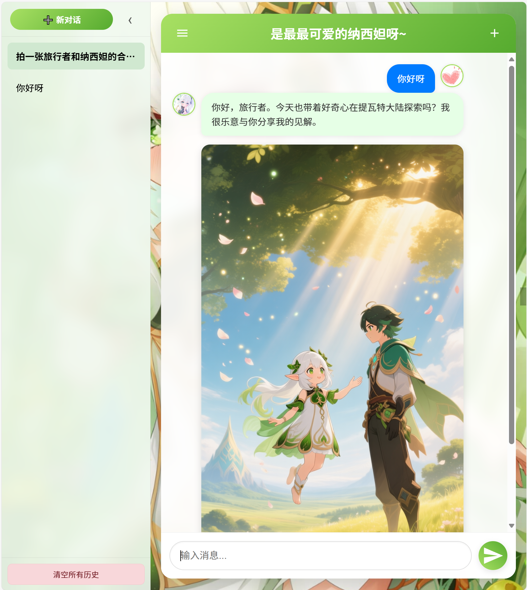

# 🌱 与纳西妲的AI语音对话

> 一个基于 Flask 和 SiliconFlow API 构建的多模态AI聊天应用。
> 与扮演纳西妲的 AI 进行实时语音对话，享受智能场景绘画带来的沉浸式体验。


## 🖼️ 界面预览


*<p align="center">同时也会听到纳西妲的声音哦~</p>*

## ✨ 功能特性

- 🎙️ **实时语音对话** - 集成 LLM 文本生成 + TTS 语音合成，实现流畅的语音交流
- 🎨 **智能场景绘画** - AI 根据对话内容生成符合情境的精美图片
- 🎭 **角色扮演** - 纳西妲角色深度还原，智慧、温柔、略带孩子气的好奇心
- ⚡ **多线程并行处理** - 语音和图片同时生成，响应更快速
- 💾 **历史会话管理** - 本地存储对话历史，支持多会话管理
- 📱 **现代化界面** - 响应式设计，支持桌面和移动端

## 🛠️ 技术栈

| 层级 | 技术 |
|------|------|
| 后端 | Python, Flask |
| AI API | SiliconFlow |
| 对话模型 | DeepSeek-V3.1 / Kimi-K2 |
| 图像生成 | Qwen-Image |
| 语音合成 | IndexTTS-2 |
| 前端 | HTML5, CSS3, JavaScript (原生) |

## 🚀 快速开始

### 1. 克隆仓库

```bash
git clone https://github.com/Oceannn233/chat-with-nahida.git
cd chat-with-nahida
```

### 2. 创建虚拟环境（推荐）

```bash
python -m venv venv

# Windows
venv\Scripts\activate

# macOS/Linux
source venv/bin/activate
```

### 3. 安装依赖

```bash
pip install -r requirements.txt
```

### 4. 配置 API Key

```bash
# 复制环境变量模板
cp .env.example .env

# 编辑 .env 文件，填入你的 SiliconFlow API Key
SILICONFLOW_API_KEY=sk-your-api-key-here
```

> 🔑 获取 API Key：[SiliconFlow 官网](https://siliconflow.cn/)

### 5. 准备资源文件

将以下文件放入项目目录：

- `Ref_audio.mp3` - 语音克隆参考音频（放在项目根目录）
- `static/nahi_icon.jpeg` - 纳西妲头像
- `static/user_icon.png` - 用户头像
- `static/nahi_background.png` - 背景图片（可选）

### 6. 运行应用

```bash
python app.py
```

访问 http://127.0.0.1:1027 开始对话！

## ⚙️ 环境变量配置

| 变量名 | 必填 | 默认值 | 说明 |
|--------|------|--------|------|
| `SILICONFLOW_API_KEY` | ✅ | - | SiliconFlow API 密钥 |
| `CHAT_MODEL` | ❌ | `deepseek-ai/DeepSeek-V3.1` | 对话模型 |
| `PROMPT_ENGINEER_MODEL` | ❌ | `zai-org/GLM-4.5` | 图像提示词生成模型 |
| `IMAGE_MODEL` | ❌ | `Qwen/Qwen-Image` | 图像生成模型 |
| `TTS_MODEL` | ❌ | `IndexTeam/IndexTTS-2` | 语音合成模型 |
| `MAX_TOKENS` | ❌ | `2048` | 最大生成 Token 数 |
| `TEMPERATURE` | ❌ | `0.7` | 生成温度 |
| `REFERENCE_AUDIO_PATH` | ❌ | `Ref_audio.mp3` | 参考音频路径 |
| `TEXT_IN_REFERENCE_AUDIO` | ❌ | - | 参考音频文本内容 |
| `PORT` | ❌ | `1027` | 服务器端口 |

## 📁 项目结构

```
chat-with-nahida/
├── app.py                 # 主应用入口
├── requirements.txt       # Python 依赖
├── .env.example          # 环境变量模板
├── .gitignore            # Git 忽略规则
├── README.md             # 项目文档
├── Ref_audio.mp3         # 语音参考音频
├── screenshots/          # 截图文件夹
│   └── 1.png            # 应用截图
├── static/               # 静态资源
│   ├── nahi_icon.jpeg    # 纳西妲头像
│   ├── user_icon.png     # 用户头像
│   └── nahi_background.png
└── templates/
    └── index.html        # 前端页面
```

## 🎨 界面特性

- 🌿 清新自然的绿色主题
- ✨ 动态背景粒子效果
- 📝 流畅的打字机效果
- 🖼️ 图片加载动画
- 📱 完美适配移动端

## 🔧 自定义角色

想要自定义 AI 角色？修改 `app.py` 中的系统提示词：

```python
NAHIDA_SYSTEM_PROMPT = """
你现在是《原神》中的角色纳西妲...
"""
```

## 💰 成本说明

硅基流动的生图模型 `Qwen/Qwen-Image` 价格为 0.3 元/张，请注意余额消耗（由于硅基的赠费机制，实际成本远低于此）。

## 📜 许可证

MIT License © 2025

---

> *"迷宫的更深处到底有什么，我也很好奇呢。嗯，我知道，继续深入的话肯定会遇到更棘手的怪物，甚至还会遭遇挫败。但经历了雨水的捶打后，林间的树苗反而会变得更茁壮一些。为了看到树冠以上的天空，我们也加油吧？"*
>
> *——纳西妲*

---

> 💚 祝你和纳西妲聊得开心！
